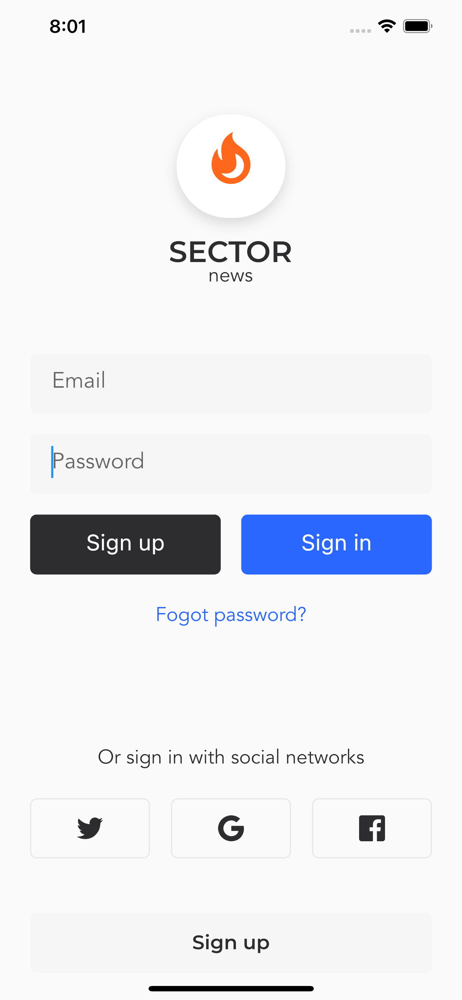

# Login  

## 一、路由

`routes.dart`  

```dart
import 'package:news_client/pages/sign_in/sign_in.dart';
import 'package:news_client/pages/sign_up/sign_up.dart';

// 静态路由
var staticRoutes = {
  "/sign-in": (context) => SignInPage(),
  "/sign-up": (context) => SignUpPage()
};
```  

`main.dart`

```dart
import 'package:flutter/material.dart';
import 'package:news_client/pages/welcome/welcomePage.dart';
import 'package:news_client/routers.dart';

void main() {
  runApp(MyApp());
}

class MyApp extends StatelessWidget {
  @override
  Widget build(BuildContext context) {
    return MaterialApp(
      title: 'Demo',
      home: WelcomePage(),
      routes: staticRoutes,
      debugShowCheckedModeBanner: false,
    );
  }
}
```  

`welcomePage.dart`  

```dart
  // 开始按钮
  Widget _buildStartButton(BuildContext context) {
    return Container(
      width: duSetWidth(295),
      height: duSetHeight(44),
      margin: EdgeInsets.only(bottom: duSetHeight(20)),
      child: FlatButton(
        child: Text("Get Start"),
        color: AppColors.primaryElement,
        textColor: AppColors.primaryElementText,
        shape: RoundedRectangleBorder(
            borderRadius: BorderRadius.all(Radius.circular(duSetWidth(6)))),
        onPressed: () {
          Navigator.pushNamed(context, "/sign-in");
        },
      ),
    );
  }
```  

## 二、登录页面

骨架  

```dart
import 'package:flutter/material.dart';
import 'package:flutter_ducafecat_news/common/utils/utils.dart';
import 'package:flutter_ducafecat_news/common/values/values.dart';
import 'package:flutter_ducafecat_news/common/widgets/widgets.dart';

class SignUpPage extends StatefulWidget {
  SignUpPage({Key key}) : super(key: key);

  @override
  _SignUpPageState createState() => _SignUpPageState();
}

class _SignUpPageState extends State<SignUpPage> {

  // logo
  Widget _buildLogo() {
    return Container();
  }

  // 注册表单
  Widget _buildInputForm() {
    return Container();
  }

  // 第三方
  Widget _buildThirdPartyLogin() {
    return Container();
  }

  // 有账号
  Widget _buildHaveAccountButton() {
    return Container();
  }

  @override
  Widget build(BuildContext context) {
    return Scaffold(
      resizeToAvoidBottomInset: false,
      ...,
      body: Center(
        child: Column(
          children: <Widget>[
            Divider(height: 1),
            _buildLogo(),
            _buildInputForm(),
            Spacer(),
            _buildThirdPartyLogin(),
            _buildHaveAccountButton(),
          ],
        ),
      ),
    );
  }
}
```  

### 2.1 主色  

`colors.dart`  

```dart
import 'dart:ui';

class AppColors {
  // 主背景 白色
  static const Color primaryBackground = Color.fromARGB(255, 255, 255, 255);

  // 主文本 灰色
  static const Color primaryText = Color.fromARGB(255, 45, 45, 47);

  // 主控件-背景 蓝色
  static const Color primaryElement = Color.fromARGB(255, 41, 103, 255);

  // 主控件-文本 白色
  static const Color primaryElementText = Color.fromARGB(255, 255, 255, 255);

  // 第二种控件-背景色 淡灰色
  static const Color secondaryElement = Color.fromARGB(255, 246, 246, 246);

  // 第二种控件-文本 浅蓝色
  static const Color secondaryElementText = Color.fromARGB(255, 41, 103, 255);

  // 第三种控件-背景色 石墨色
  static const Color thirdElement = Color.fromARGB(255, 45, 45, 47);
}
```  

### 2.2 画带阴影的椭圆图标

`shadows.dart`  

```dart
import 'package:flutter/material.dart';

class Shadows {
  static const BoxShadow primaryShadow = BoxShadow(
      color: Color.fromARGB(38, 27, 27, 29),
      offset: Offset(0, 5),
      blurRadius: 10);
}
```  

`_bulidLogo`  

```dart
Widget _buildLogo() {
    return Container(
      width: duSetWidth(110),
      margin: EdgeInsets.only(top: duSetHeight(40 + 44.0)),
      child: Column(
        crossAxisAlignment: CrossAxisAlignment.stretch,
        children: [
          Container(
            height: duSetWidth(76),
            width: duSetWidth(76),
            margin: EdgeInsets.symmetric(horizontal: duSetWidth(15)),
            child: Stack(
              alignment: Alignment.center,
              children: [
                Positioned(
                  left: 0,
                  top: 0,
                  right: 0,
                  child: Container(
                    height: duSetHeight(76),
                    decoration: BoxDecoration(
                        color: AppColors.primaryBackground,
                        boxShadow: [Shadows.primaryShadow],
                        borderRadius: BorderRadius.all(
                            Radius.circular(duSetWidth(76 * 0.5)))),
                    child: Container(),
                  ),
                ),
                Positioned(
                  top: duSetWidth(13),
                  child: Image.asset(
                    "assets/images/logo.png",
                    fit: BoxFit.none,
                  ),
                )
              ],
            ),
          ),
          Container(
            margin: EdgeInsets.only(top: duSetHeight(15)),
            child: Text(
              "SECTOR",
              textAlign: TextAlign.center,
              style: TextStyle(
                color: AppColors.primaryText,
                fontFamily: "Montserrat",
                fontWeight: FontWeight.w600,
                fontSize: duSetFontSize(24),
                height: 1,
              ),
            ),
          ),
          Text(
            "news",
            textAlign: TextAlign.center,
            style: TextStyle(
              color: AppColors.primaryText,
              fontFamily: "Avenir",
              fontWeight: FontWeight.w400,
              fontSize: duSetFontSize(16),
              height: 1,
            ),
          )
        ],
      ),
    );
  }
```  

### 2.3 登录表单

`_buildInputForm`

```dart
Widget _buildInputForm() {
    return Container(
      width: duSetWidth(295),
      margin: EdgeInsets.only(top: duSetWidth(49)),
      child: Column(
        children: [
          Container(
            height: duSetHeight(44),
            decoration: BoxDecoration(
                color: AppColors.secondaryElement,
                borderRadius: Radii.k6pxRadius),
            child: TextField(
              controller: emailController,
              keyboardType: TextInputType.emailAddress,
              decoration: InputDecoration(
                  hintText: "Email",
                  contentPadding: EdgeInsets.fromLTRB(20, 10, 0, 9),
                  border: InputBorder.none),
              style: TextStyle(
                  color: AppColors.primaryText,
                  fontFamily: "Avenir",
                  fontWeight: FontWeight.w400,
                  fontSize: duSetFontSize(18)),
              maxLines: 1,
              autocorrect: false,
            ),
          ),
          Container(
              height: duSetHeight(44),
              margin: EdgeInsets.only(top: duSetHeight(15)),
              decoration: BoxDecoration(
                  color: AppColors.secondaryElement,
                  borderRadius: Radii.k6pxRadius),
              child: TextField(
                controller: passController,
                keyboardType: TextInputType.number,
                decoration: InputDecoration(
                    hintText: "Password",
                    contentPadding: EdgeInsets.fromLTRB(20, 10, 0, 9),
                    border: InputBorder.none),
                style: TextStyle(
                    color: AppColors.primaryText,
                    fontFamily: "Avenir",
                    fontWeight: FontWeight.w400,
                    fontSize: duSetFontSize(18)),
                maxLines: 1,
                autocorrect: false,
                obscureText: true,
              )),
          Container(
            height: duSetHeight(44),
            margin: EdgeInsets.only(top: duSetHeight(15)),
            child: Row(
              children: [
                Container(
                  width: duSetWidth(140),
                  height: duSetHeight(44),
                  child: FlatButton(
                    onPressed: () {},
                    color: AppColors.thirdElement,
                    shape:
                        RoundedRectangleBorder(borderRadius: Radii.k6pxRadius),
                    child: Text(
                      "Sign up",
                      textAlign: TextAlign.center,
                      style: TextStyle(
                          color: AppColors.primaryElementText,
                          fontWeight: FontWeight.w400,
                          fontSize: duSetFontSize(18),
                          height: 1),
                    ),
                  ),
                ),
                Spacer(),
                Container(
                  width: duSetWidth(140),
                  height: duSetHeight(44),
                  child: FlatButton(
                    onPressed: () {},
                    color: AppColors.primaryElement,
                    shape:
                        RoundedRectangleBorder(borderRadius: Radii.k6pxRadius),
                    child: Text(
                      "Sign in",
                      textAlign: TextAlign.center,
                      style: TextStyle(
                          color: AppColors.primaryElementText,
                          fontWeight: FontWeight.w400,
                          fontSize: duSetFontSize(18),
                          height: 1),
                    ),
                  ),
                )
              ],
            ),
          ),
          Container(
            height: duSetHeight(22),
            margin: EdgeInsets.only(top: duSetHeight(20)),
            child: FlatButton(
              onPressed: () {},
              child: Text(
                "Fogot password?",
                textAlign: TextAlign.center,
                style: TextStyle(
                  color: AppColors.secondaryElementText,
                  fontFamily: "Avenir",
                  fontWeight: FontWeight.w400,
                  fontSize: duSetFontSize(16),
                  height: 1, // 设置下行高，否则字体下沉
                ),
              ),
            ),
          )
        ],
      ),
    );
  }
```  

`lib/common/values/radii.dart`

```dart
import 'package:flutter/rendering.dart';

class Radii {
  static const BorderRadiusGeometry k6pxRadius =
      BorderRadius.all(Radius.circular(6));
}
```  

### 2.4 第三方登录

`_buildThirdPartyLogin`

```dart
Widget _buildThirdPartyLogin() {
    return Container(
      width: duSetWidth(295),
      margin: EdgeInsets.only(bottom: duSetHeight(40)),
      child: Column(
        children: <Widget>[
          Text(
            "Or sign in with social networks",
            textAlign: TextAlign.center,
            style: TextStyle(
              color: AppColors.primaryText,
              fontFamily: "Avenir",
              fontWeight: FontWeight.w400,
              fontSize: duSetFontSize(16),
            ),
          ),
          Padding(
            padding: EdgeInsets.only(top: duSetHeight(20)),
            child: Row(
              children: <Widget>[
                btnThirdSocialWidget('twitter'),
                Spacer(),
                btnThirdSocialWidget('google'),
                Spacer(),
                btnThirdSocialWidget('facebook'),
              ],
            ),
          )
        ],
      ),
    );
  }
```  

`lib/pages/sign_in/button_widget.dart`

```dart
import 'package:flutter/material.dart';
import 'package:news_client/common/utils/utils.dart';
import 'package:news_client/common/values/values.dart';

Widget btnThirdSocialWidget(String fileName) {
  return Container(
    width: duSetWidth(88),
    height: duSetHeight(44),
    child: FlatButton(
      onPressed: () {},
      shape: RoundedRectangleBorder(
          side: Borders.primaryBoder, borderRadius: Radii.k6pxRadius),
      child: Image.asset(
        "assets/images/icons-$fileName.png",
      ),
    ),
  );
}
```  
 
### 2.5 注册按钮

`_buildSignupButton`

```dart
Widget _buildSignupButton() {
    return Container(
      width: duSetWidth(295),
      height: duSetHeight(44),
      margin: EdgeInsets.only(bottom: duSetHeight(20)),
      child: FlatButton(
        onPressed: () => {},
        color: AppColors.secondaryElement,
        shape: RoundedRectangleBorder(
          borderRadius: Radii.k6pxRadius,
        ),
        child: Text(
          "Sign up",
          textAlign: TextAlign.center,
          style: TextStyle(
            color: AppColors.primaryText,
            fontFamily: "Montserrat",
            fontWeight: FontWeight.w500,
            fontSize: duSetFontSize(16),
            height: 1,
          ),
        ),
      ),
    );
  }
```

